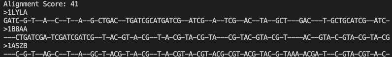

# Multiple Sequence Alignment (MSA) Tool (CSE 185 Final Project)
 [](https://www.python.org/downloads/release/python-360/)   
## Overview 
This respository provides tools and resources for performing Multiple Sequence Alignment (MSA), a fundamental task in bioinformatics and computational biology. MSA allows user to align and identify similarities and differences among multiple biological sequences, such as DNA, RNA, or protein sequences. 

## Usage 
The MSA tools can be used to align up to three sequences. Provide the input sequences in suported fasta format and run the alignment command. 

### Command-Line
Ensure that you are in the `MultipleSequenceAlignment` directory.
```
python MSA.py <filepath/input.fasta>
```
Replace `<filepath/input.fasta>` with the path of the fasta file, or move the fasta file input into the `MultipleSequenceAlignment` directory and provide the fasta file as input.

### Output
The output of the code will be the alignment score along with the aligned sequences in a fasta file format, similar to MAAFT's. For exact format look at example of running the code below.

### Example
To run `MSA` on a small test example (using files in this repo):
`python3 MSA.py testing/shortDNA.fasta`
Your ouput should look similar to: 



## Installation 
To use the MSA tools provided in this repository, you must already have python installed. If you do not have python installed proceed [here](https://www.python.org/downloads/) and follow instructions to install python for your operating system. Once you have python installed the code should be able to run properly.

Clone the repository:
```
git clone https://github.com/Yshzi/MultipleSequenceAlignment.git
```
Set up the environment:
```
cd MultipleSequenceAlignment
```
Now you should be all set to run the code! For benchmarking please change to the `benchmarking` directory with `cd` and read the `README.md` there!

## File Structure
### Multiple Sequence Alignment
In the `MultipleSequenceAlignment` directory you can find this `README.md` file, `MSA.py`, and `ScoreCalculator.py`.
### Testing
In the `Testing` directory you can find test `.fasta` files to be used for testing `MSA.py`. The test files are: `bigProtein.fasta`, `hemogoblin.fasta`, `shortDNA.fasta`, and `shortProtein.fasta`. In the ben

The basic usage of 'ScoreCalculator' is:
'python ScoreCalculator.py input.txt'
to run 'ScoreCalculator.py on example alignments from MSA on set 1:
'python 'ScoreCalculator.py alighments/msa_set1.txt'


### Contributors 
The repository was generated by Dan Le, Andrew Quach, and Joseph Mattingly with inspiration from MAFFT

Please submit a pull request with any corrections or suggestions.
