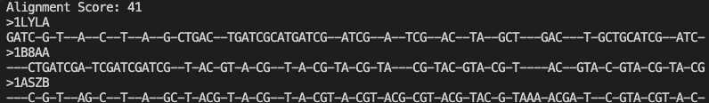
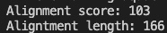

# Multiple Sequence Alignment (MSA) Tool (CSE 185 Final Project)
 [](https://www.python.org/downloads/release/python-360/)   
## Overview 
This respository provides tools and resources for performing Multiple Sequence Alignment (MSA), a fundamental task in bioinformatics and computational biology. `MSA.py` allows user to align and identify similarities and differences among multiple biological sequences, such as DNA, RNA, or protein sequences. 

## Usage 
The `MSA.py` tools can be used to align up to three sequences. Provide the input sequences in suported fasta format and run the alignment command. 

### Command-Line
Ensure that you are in the `MultipleSequenceAlignment` directory.
```
python MSA.py <filepath/input.fasta>
```
Replace `<filepath/input.fasta>` with the path of the fasta file, or move the fasta file input into the `MultipleSequenceAlignment` directory and provide the fasta file as input.

### Output
The output of the code will be the alignment score along with the aligned sequences in a fasta file format, similar to MAAFT's. For exact format look at example of running the code below.

### Example
To run `MSA.py` on a small test example (using files in this repo):
`python3 MSA.py testing/shortDNA.fasta`
Your ouput should look similar to: 



## Installation 
To use the `MSA.py` tools provided in this repository, you must already have python installed. If you do not have python installed proceed [here](https://www.python.org/downloads/) and follow instructions to install python for your operating system. Once you have python installed the code should be able to run properly.

Clone the repository:
```
git clone https://github.com/Yshzi/MultipleSequenceAlignment.git
```
Set up the environment:
```
cd MultipleSequenceAlignment
```
Now you should be all set to run the code! For benchmarking please change to the `benchmarking` directory with `cd` and read the `README.md` there!

## File Structure
### Multiple Sequence Alignment
In the `MultipleSequenceAlignment` directory you can find this `README.md` file, `MSA.py`, and `ScoreCalculator.py`.

### Testing
In the `Testing` directory you can find test `.fasta` files to be used for testing `MSA.py`. The test files are: `bigProtein.fasta`, `hemogoblin.fasta`, `shortDNA.fasta`, and `shortProtein.fasta`.
 
### Benchmarking
In the `Benchmarking` directory you can find three files and two directories for benchmarking. A `README.md` file, `benchmark.fasta` that contains protein sequences that were used for benchmarking our code, and `ScoreCalculator.py` which contains code to get alignment score of sequences. The two directories are `Alignments` and `Datasets`

#### Datasets
The 'Dataset' directory contains 2 fasta files `set1.fasta` and `set2.fasta`. `set1.fasta` contains peptide sequences for human, mouse, and chicken hemoglobin subunit alpha. `set2.fasta` contains peptide sequences for human, mouse, and frog hemoglobin subunit alpha.

#### Alignments
Alignments contains the output of running `MAAFT` and `MSA.py` on the files in `Datasets` and have been modified so that they work with `ScoreCalculator.py`. We just made the output be one line and took out the names of the sequences so that it is compatible with `ScoreCalculator.py`

#### ScoreCalculaotr.py
##### Usage
ScoreCalculor.py is a python script that takes in a text file containing the 3 sequence alignment with no headers and returns the score and length of the alignment.
```
python3 ScoreCalculator.py <input.txt>
```

###### Example
To run `ScoreCalculator.py` on example alignments from `MSA.py` on set 1 (using files in this repo):
`python3 'ScoreCalculator.py alighments/msa_set1.txt`
Your ouput should look similar to: 



### Contributors 
The repository was generated by Dan Le, Andrew Quach, and Joseph Mattingly with inspiration from MAFFT. Please submit a pull request with any corrections or suggestions.
